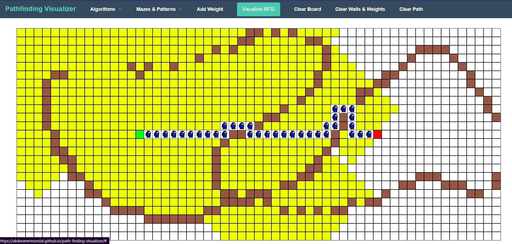
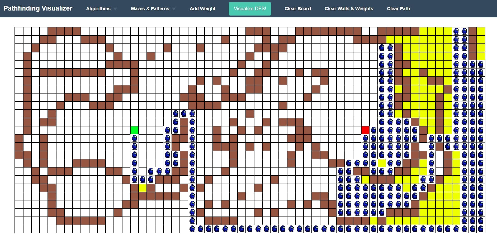
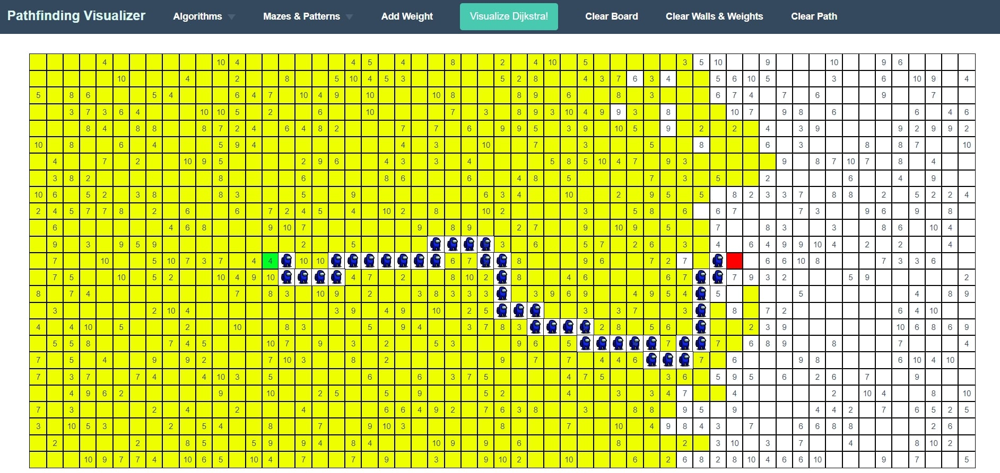
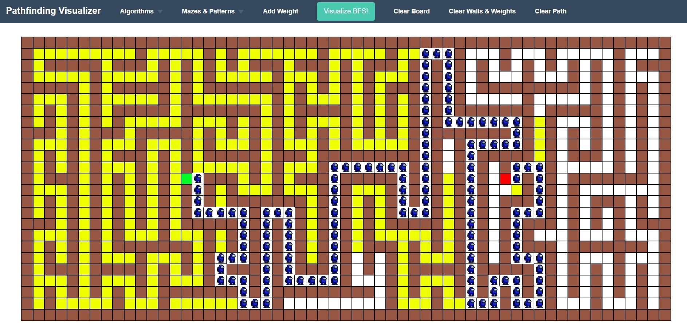

# Path finding Visualizer

I made this project because of the importance of graphs and their algorithms and how easy they can be if visualised properly.
You can view the project [here](https://alokeveermondal.github.io/path-finding-visualizer/).

## Project consists of two sections:- 

### 1. Grid
Initially on the grid you will see a start point and an end point. You can drag and drop the points anywhere on the grid.
Each cell in the grid represents a node. You can modify the properties of a cell by either making it a wall or increasing it weight.

You can choose from the **Algorithms** that you want to visualise and then **Visualise** button will animate the path search procedure from start node to end node using the corresponding algorithm.

You can turn the grid into mazes obtained by different Algorithms like **Recursive Backtracking** or **Kruskal's Algorithm** or **Prim's Algorithm** and many others.

#### BFS

#### DFS

#### Dijkstra

#### Mazes
